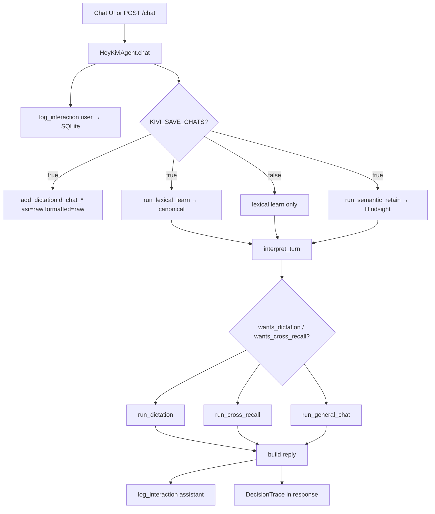
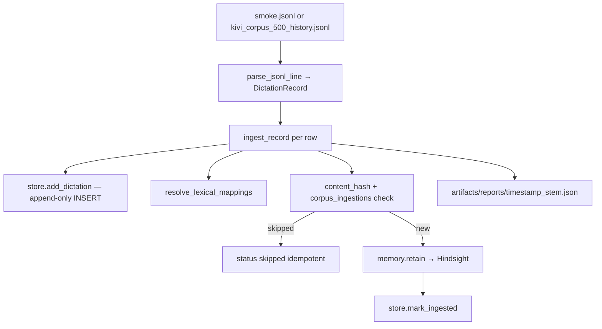

# Hey Kivi Phase 1 (`hindsight_pipeline_2`)

Golden Goose submission: a self-contained chat agent with **Hindsight** durable memory, **SQLite** dictation history (FTS5 find), lexical learning, and a fully inspectable **DecisionTrace** on every turn.

> Hindsight stores and retrieves. Kivi owns worthiness, reconcile, relevance, and when memory changes behavior.

**Primary review path:** `cd hindsight_pipeline_2` → restore baseline snapshot → Docker Compose — see [docs/RUN.md](docs/RUN.md).

> Reviewers should restore the included baseline snapshot. Full corpus import is an optional reproducibility path.

## What it does

1. **Lexical mappings (Kivi)** — LLM extract → validate → SQLite → deterministic resolve (alias→canonical).
2. **Semantic memory (Hindsight)** — canonical user text retained; cross-recall synthesizes answers from prior memories.
3. **Find & polish** — deterministic FTS5 `find_dictations` → optional LLM polish → lexical resolve on stored dictations.
4. **Corpus import** — JSONL → SQLite (append-only) → lexical canonicalize → Hindsight retain with provenance.

**Hard rules:** never create durable memory from Kivi’s own output; prefer fewer high-quality memories; polish applies on the find path only (chat dictations store `asr=formatted=raw` at save time).

## Architecture

### Chat flow



### Corpus ingestion flow



## Ports & paths

| Component | Port / path | Purpose |
|-----------|-------------|---------|
| Chat / API | **8002** — `http://localhost:8002` | FastAPI: `/chat`, `/corpus/import`, `/health`, inspect endpoints |
| Hindsight API | **8888** | Retain/recall backend |
| Hindsight UI | **9999** | Hindsight admin UI |
| SQLite | `KIVI2_DB_PATH` → `artifacts/runtime/kivi.sqlite3` | Dictations, lexical, interactions, FTS, corpus_ingestions |

## Quick start (offline tests — no Docker)

```bash
cd hindsight_pipeline_2
pip install -r requirements.txt
pytest evals/tests -q
python -m hindsight_pipeline_2.evals.cli.runner --backend stub
```

Default pytest uses **StubMemory** (no Docker, no API keys). See [Tests](#tests) below for tiers and Docker integration.

## Quick start (Docker — reviewer path)

```bash
cd hindsight_pipeline_2
cp .env.example .env   # set GROQ_API_KEY
# Path A: restore ops/baseline-volumes (see docs/RUN.md §5b)
docker compose --env-file .env up --build -d
curl http://localhost:8002/stats/golden_goose_eval_user
```

Open http://localhost:8002 — use the **Query library** tab (requires import or snapshot). **Seed demo** is Developer-only and wipes SQLite for the current user.

**LLM providers:** Hey Kivi internal LLM supports **Groq or Gemini only** (`LLM_PROVIDER`). Hindsight uses separate container env vars. OpenAI / LiteLLM are not supported.

Full commands: [docs/RUN.md](docs/RUN.md).

## User control

- **See why** — Developer tab shows `DecisionTrace` on every turn.
- **Refuse when unsupported** — cross-recall and find abstain instead of inventing facts.
- **Teach spelling/names** — explicit corrections create lexical mappings in chat.
- **Forget / reset** — no in-app forget UI; engineers use `docker compose down -v` or re-import after `clear_user`.
- **Provenance** — parent dictation ids are tracked in SQLite `corpus_ingestions`, not natively in Hindsight memory cards.

## API endpoints (port 8002)

| Method | Path | Description |
|--------|------|-------------|
| `GET` | `/` | Chat HTML UI |
| `GET` | `/health` | `{ok, memory_backend, hindsight_base_url, require_llm, llm_loaded, db_path}` |
| `POST` | `/chat` | `{message, user_id}` → `{reply, trace, metrics}` |
| `POST` | `/seed` | Seed demo dictations + lexical (+ Hindsight when reachable) |
| `POST` | `/corpus/import` | JSONL → SQLite → lexical → Hindsight retain |
| `GET` | `/memories/{user_id}` | List Hindsight memories |
| `GET` | `/dictations/{user_id}` | List SQLite dictations |
| `GET` | `/lexical/{user_id}` | Active lexical mappings |

## Decision trace glossary

Every `/chat` response includes a `trace` object and a `metrics` block:

| `metrics` field | Meaning |
|-----------------|---------|
| `elapsed_ms` | Server-side chat latency |
| `db_before`, `db_after`, `db_delta` | SQLite row counts for this user |
| `llm_call_count`, `retain_call_count` | Model steps this turn |
| `cost_usd` | Estimate via `KIVI_ESTIMATED_LLM_COST_USD` and `KIVI_ESTIMATED_RETAIN_COST_USD` |

| Field | Meaning |
|-------|---------|
| `wants_dictation`, `wants_cross_recall` | Interpret routing flags |
| `canonicalized_message` | After lexical learn |
| `semantic_retain`, `semantic_retain_preview` | Hindsight retain this turn |
| `memories_retained/ignored/updated` | Lexical pipeline |
| `memories_considered`, `retrieval_backend`, `retrieval_query` | Recall hits (`hindsight` or `none`); each card may include `source_dictation_id` |
| `find_query`, `candidates`, `selected_dictation_id` | Dictation find path |
| `source_interactions`, `source_dictation_id` | Provenance (`d_chat_*` per turn) |
| `tools_used`, `decision`, `reason` | Outcome (`answer` \| `abstain`) |
| `llm_calls` | `[{step, source, output}]` per LLM/rules step |

Example abstain trace:

```json
{
  "reply": "I don't have enough in your history to say what you've been working on for that.",
  "trace": {
    "wants_dictation": false,
    "wants_cross_recall": true,
    "semantic_retain": true,
    "memories_considered": [],
    "retrieval_backend": "hindsight",
    "retrieval_query": "What have I been working on for the Kivi meeting?",
    "tools_used": ["hindsight_recall"],
    "decision": "abstain",
    "reason": "No relevant durable memories for cross-recall.",
    "source_dictation_id": "d_chat_i_abc123",
    "llm_calls": [{"step": "interpret", "source": "llm", "output": {}}]
  }
}
```

## AI use disclosure

Routing (interpret), synthesis, polish, and lexical extraction may call an LLM (Groq or Gemini). The **DecisionTrace** records every step: which LLM was used, rules fallback, or skipped; canonicalization; tools invoked; memories considered; and the abstain/answer decision with reason. Corpus eval reports under `artifacts/reports/` include full traces per probe. No hidden memory writes — retain paths are explicit in `tools_used` and `semantic_retain`.

## Tests

All commands assume `cd hindsight_pipeline_2`.

### Test structure

```
evals/
  cases/                 # JSON case definitions (demo, query library, integrity)
  runners/               # CLI implementations (quality, corpus, probe, integrity)
  cli/                   # python -m entry implementations
  tests/                 # pytest tiers
    unit/                # find, lexical, routing
    agent/               # full HeyKiviAgent turns
    corpus/              # JSONL import + ingest reports
    contract/            # FastAPI /health + /chat shape
    scenario/            # JSON case runners (stub backend)
  integration/           # Docker+Hindsight notes
  conftest.py, paths.py, sync_cases.py
  runner.py, corpus_runner.py, query_probe.py   # thin shims → cli/
artifacts/evals/         # Generated eval output (e.g. last_run.json)
```

Each `test_*.py` file lists every test and what it covers in its **module docstring** at the top of the file. More detail: [evals/README.md](evals/README.md).

| Tier | When to run | Backend |
|------|-------------|---------|
| `tests/unit/` | Fast regression on find, lexical, routing | Stub |
| `tests/agent/` | End-to-end agent turn contracts | Stub + seeded demo |
| `tests/corpus/` | Import pipeline and ingest reports | Stub |
| `tests/contract/` | HTTP API shape for UI and probe | Stub (TestClient) |
| `tests/scenario/` | JSON case runners wired correctly | Stub |
| CLI `runner` / `corpus_runner` / `query_probe` | Integration against live stack | Hindsight (Docker) |

### Pytest (offline — 75 tests, no Docker)

```bash
pip install -r requirements.txt
pytest evals/tests -q
pytest evals/tests/unit -q
pytest evals/tests/scenario -q
```

### JSON case runners (stub)

```bash
python -m hindsight_pipeline_2.evals.cli.runner --backend stub
python -m hindsight_pipeline_2.evals.cli.corpus_runner --backend stub --limit 5
```

Report: `artifacts/evals/last_run.json`

### Docker integration (live Hindsight + Groq)

Start the stack first ([docs/RUN.md](docs/RUN.md) Path A or B):

```bash
docker compose --env-file .env up -d

# Host — against localhost:8002 / :8888
python -m hindsight_pipeline_2.evals.cli.runner --backend hindsight
python -m hindsight_pipeline_2.evals.cli.corpus_runner \
  --backend hindsight --user-id corpus_repro_user
python -m hindsight_pipeline_2.evals.cli.query_probe --base-url http://localhost:8002

# Or inside the container (Hindsight URL http://hindsight:8888)
docker compose --env-file .env exec hey-kivi \
  python -m hindsight_pipeline_2.evals.cli.corpus_runner \
    --backend hindsight --limit 5 --user-id corpus_repro_user
```

- **`corpus_runner`** — in-process agent after JSONL import; writes `artifacts/reports/`.
- **`query_probe`** — HTTP POST of every `query_cases.json` message to `/chat` (same path as the chat UI).

Reports: `artifacts/reports/<stem>_<timestamp>.json`.

**Pinned submission artifacts:**
- `artifacts/evals/last_run.json` — offline stub quality suite (8 cases, no API keys)
- `artifacts/reports/kivi_corpus_500_history.latest.json` — documents **baseline generation** for `golden_goose_eval_user` (historical path `corpus/…` in the report metadata is from the original import run)
- `artifacts/reports/query_probe.latest.json` — live HTTP probe against Path A baseline (regenerate via §8c)

After editing `evals/cases/query_cases.json`:

```bash
python -m hindsight_pipeline_2.evals.sync_cases
```

### Corpus import CLI (checkpointed reports)

`import_corpus` writes a report at **loop start** and **after every row** (atomic). If interrupted, `status: "partial"` is preserved. Re-run skips already-retained rows (idempotent).

```bash
# Path B only — use a fresh user id; never import into golden_goose_eval_user (baseline user)
python -m hindsight_pipeline_2.kivi.corpus.import_corpus \
  --path hindsight_pipeline_2/data/corpus/kivi_corpus_500_history.jsonl \
  --user-id corpus_repro_user --progress
```

Report fields: `status`, `imported`/`skipped`/`failed`, per-row `elapsed_ms`, `db_before`/`db_after`, `retain_call_count`, `cost_usd` (set `KIVI_ESTIMATED_RETAIN_COST_USD` per call to estimate).

On successful completion, also writes `artifacts/reports/<stem>.latest.json`.

Quick stdout snapshot (first 20 rows):

```bash
python -m hindsight_pipeline_2.ops.scripts.state_snapshot --user-id demo_user
```

## Layout

```
hindsight_pipeline_2/
  paths.py              # Central filesystem paths (package root)
  kivi/                 # Application code
    agent.py, api.py, config.py, models.py
    capabilities/       # interpret, cross_recall, dictation, lexical_learn, …
    storage/            # dictation_store, lexical_store, lexical
    memory/             # hindsight_adapter, stub_memory
    lexical/            # lexical_extract
    llm/                # Groq/Gemini client
    corpus/             # import_corpus
  data/corpus/          # JSONL corpora
  artifacts/
    runtime/            # kivi.sqlite3 (Docker volume mount)
    reports/            # ingest + query_probe JSON
    evals/              # last_run.json
  web/chat/             # Chat UI (served at /static/chat/)
  web/assets/           # query_cases.json for Query library
  ops/docker/           # Dockerfile + compose
  ops/scripts/          # restore/snapshot baseline, state_snapshot
  ops/baseline-volumes/ # Path A tarballs
  docs/                 # RUN.md, VISION.md, POSITIONING.md
  evals/                # pytest tiers + case runners (see Tests above)
```

## Environment variables

| Var | Default | Notes |
|-----|---------|--------|
| `GROQ_API_KEY` / `GEMINI_API_KEY` | — | LLM for interpret/synthesize/polish |
| `LLM_PROVIDER` | `groq` | `groq` \| `gemini` |
| `HINDSIGHT_BASE_URL` | `http://localhost:8888` | Real Hindsight (`http://hindsight:8888` in Compose) |
| `HINDSIGHT_BANK_PREFIX` | `kivi` | Bank id prefix (`kivi_<user_id>`; baseline snapshot requires `kivi`) |
| `HINDSIGHT_RECALL_BUDGET` | `mid` | Hindsight recall budget |
| `KIVI2_DB_PATH` | `artifacts/runtime/kivi.sqlite3` | SQLite path |
| `KIVI_API_PORT` | `8002` | API listen port |
| `KIVI_REQUIRE_LLM` | `true` | `false` for rules-only offline |
| `KIVI_SAVE_CHATS` | `false` | `true` saves chat turns as dictations + semantic retain |

Template: [`.env.example`](.env.example) → copy to `hindsight_pipeline_2/.env` for Docker.

## SQLite schema

Schema is applied automatically on first API start (`DictationStore._init_schema`, `LexicalStore._init_schema`). No manual migration step.

| Table | Purpose |
|-------|---------|
| `dictations` | ASR + formatted transcripts per `user_id` |
| `dictations_fts` | FTS5 external-content index for find |
| `corpus_ingestions` | Retain provenance per dictation (`memory_id`, `content_hash`) |
| `interactions` | Chat interaction log |
| `lexical_mappings` | Alias → canonical spelling/name preferences |

**User IDs:** Path A review uses `golden_goose_eval_user` (baseline). Path B corpus import must use a **different** user (e.g. `corpus_repro_user`) — see [docs/RUN.md](docs/RUN.md).

## Limitations (Phase 1)

- No speech ASR, Accept/Reject UI, or LangGraph orchestration
- Find uses deterministic FTS + calendar filters; polish requests return one note when possible
- Corpus `lexical_*` rows bootstrap SQLite mappings on first chat (e.g. Trivandrum → Thiruvananthapuram)
- Ollama/embeddings not required (Hindsight handles semantic retain/recall)
- docs/POSITIONING.md / docs/VISION.md are user-authored submission docs

## Manual SQLite inspection

```bash
sqlite3 hindsight_pipeline_2/artifacts/runtime/kivi.sqlite3 "SELECT id, user_id, asr, formatted, created_at FROM dictations LIMIT 5;"
sqlite3 hindsight_pipeline_2/artifacts/runtime/kivi.sqlite3 "SELECT * FROM lexical_mappings WHERE active=1;"
sqlite3 hindsight_pipeline_2/artifacts/runtime/kivi.sqlite3 "SELECT * FROM corpus_ingestions LIMIT 5;"
```
